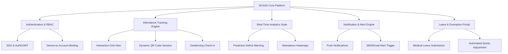
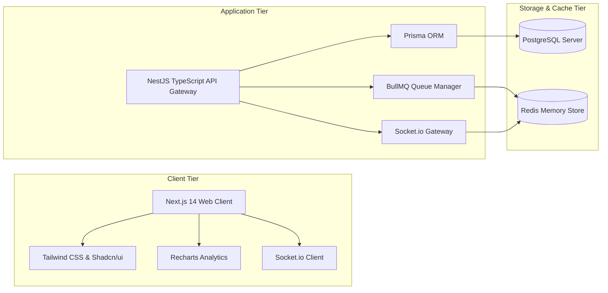
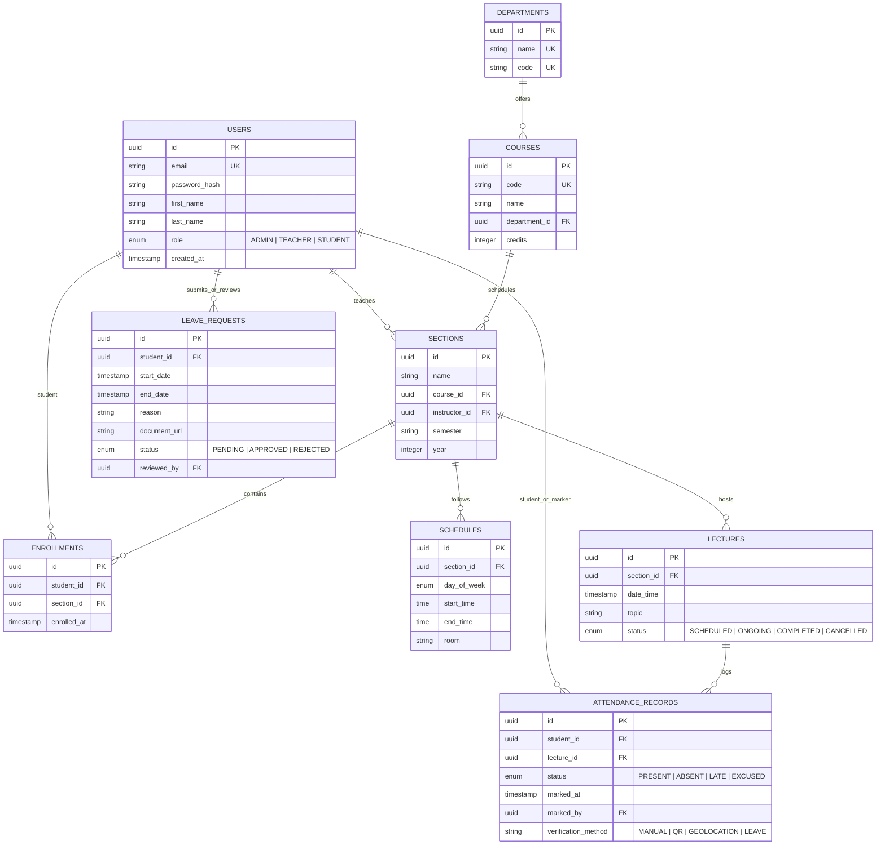
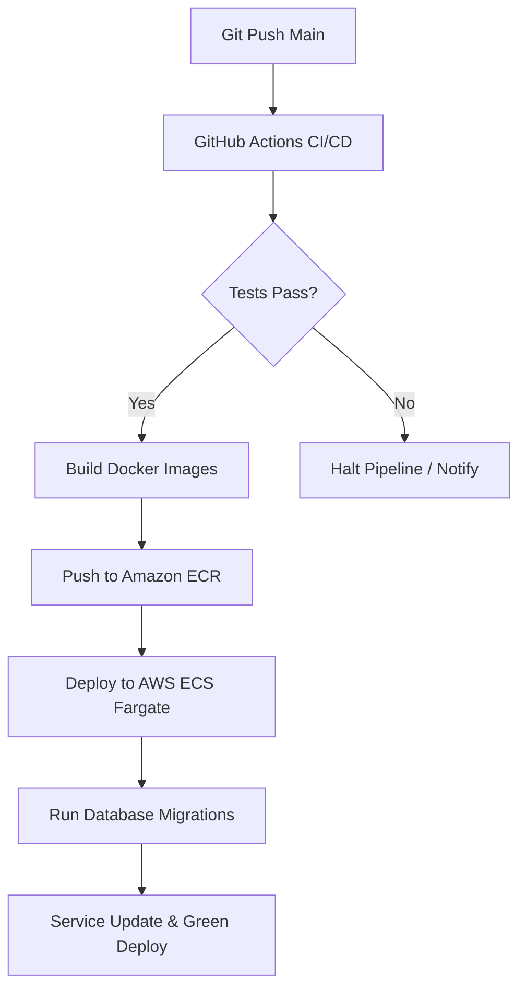
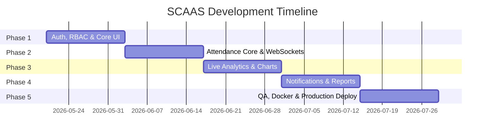

# Smart Campus Attendance & Analytics System (SCAAS)
## Project Blueprint & System Architecture Design

> [!NOTE]
> This document provides a production-grade blueprint for designing, building, and deploying the **Smart Campus Attendance & Analytics System (SCAAS)**. It serves as a single source of truth for engineering, product, and operations teams.

---

## 1. Executive Summary & Vision

The **Smart Campus Attendance & Analytics System (SCAAS)** is a full-stack, real-time web platform engineered to eliminate paper-based attendance tracking, reduce manual administrative burden, and provide students and faculty with actionable, data-driven academic insights.

### Core Value Propositions
* **For Faculty:** Mark attendance in seconds using dynamic QR codes, geofenced automated sign-ins, or interactive grid layouts.
* **For Students:** View live attendance statistics, track performance trends across subjects, receive predictive alerts before falling below minimum attendance thresholds, and request leaves digitally.
* **For Administrators:** High-level dashboard showing campus-wide compliance, class attendance trends, department analytics, and automatic audit report generation.

---

## 2. User Roles & Access Control (RBAC)

The system enforces strict **Role-Based Access Control (RBAC)** across four key personas:

| Role | Core Responsibilities | Key Dashboard Features |
| :--- | :--- | :--- |
| **System Administrator** | Manages campus metadata (departments, courses, schedules, accounts). | Campus-wide analytics, audit logs, system configurations, automated reports. |
| **Teacher / Instructor** | Configures class schedules, marks/edits attendance, starts live sign-in sessions. | Class attendance grids, live QR/geofenced session controller, student analytical views, leave approval panel. |
| **Student** | Checks personal attendance, views predictive warnings, generates QR codes, submits leaves. | Personal analytics dashboard, leave request portal, subject-wise checklist, calendar view. |
| **Academic Supervisor** | Monitors department-level faculty performance and student compliance. | Departmental summary, high-absenteeism alerts, compliance metrics, historical patterns. |

---

## 3. Core Modules & Feature Breakdown



### A. Authentication & User Profile Management
* **Single Sign-On (SSO):** Integration with campus identity providers (Google Workspace, Microsoft Entra ID) using OpenID Connect (OIDC) / OAuth2.
* **Role-Based Routing:** Automated layout transitions and route guarding based on JWT claims.
* **Device Binding (Security):** (Optional) Restricting student check-ins to unique physical MAC/IP addresses or validated device browser fingerprints during live sign-in sessions.

### B. The Attendance Engine
* **Interactive Grid:** A highly optimized grid layout for teachers to manually toggle or bulk-mark attendance with shortcuts.
* **Dynamic QR Codes:** Real-time rotating QR codes displayed on class monitors that regenerate every 5 seconds. Students scan via their mobile web app. A built-in anti-tampering algorithm checks student GPS location against the lecture hall's coordinates.
* **Geofenced Check-in:** Teacher opens a geofenced portal (radius of 15–30 meters around classroom coordinates). Students check in with one click, verified by browser geolocation API.

### C. Real-Time Analytics & Reporting
* **Interactive Visualizations:** Subject-wise breakdown, historical heatmaps, and weekly target goals using fluid dashboard charts.
* **Predictive Deficit Alert (PDA):** Machine learning/algorithmic projection showing exactly how many consecutive lectures a student can afford to miss or *must* attend to remain above the target compliance threshold (e.g., 75%).
* **Reporting API:** Generate and download cryptographically signed PDF/Excel compliance reports.

### D. Leave & Exemption Management
* **Digital Workflow:** Students upload medical certificates or college event authorization forms directly to a digital queue.
* **Automated Exemption Processing:** Once approved by faculty/admins, the system recalculates the student's adjusted attendance percentage dynamically.

---

## 4. Recommended Technology Stack

We propose a modern, scalable, and responsive **JavaScript/TypeScript Ecosystem** utilizing high-performance data layering.



### Client Layer (Frontend)
* **Framework:** **Next.js 14 / React 18** (App Router) with TypeScript. Provides Server-Side Rendering (SSR) for blazing-fast admin pages and high-performance search engine optimization (SEO) for public portals.
* **Styling & UX:** **Vanilla CSS** + **Tailwind CSS** with **Shadcn/ui** for fluid, modern glassmorphic dashboards.
* **State & Real-Time:** **Zustand** (lightweight state management), **TanStack Query** (caching and data-fetching), and **Socket.io-client** for instant live-syncing.
* **Visualization:** **Recharts** (highly responsive SVG graphs for analytics).

### Service Layer (Backend)
* **Framework:** **NestJS** or **FastAPI**. NestJS (TypeScript) provides a highly structured enterprise codebase using controllers, services, and dependency injection.
* **WebSockets:** **Socket.io** integration for handling dynamic session triggers (starting/ending classes, scanning codes).
* **Worker Queue:** **BullMQ** (powered by Redis) for handling high-volume background tasks such as compiling campus-wide analytics and sending push notifications.

### Data Layer (Storage & Cache)
* **Primary Database:** **PostgreSQL** for storing structured relationship maps (Users, Courses, Schedules, Attendance Records).
* **Object-Relational Mapping (ORM):** **Prisma ORM** for fully typed queries and seamless schema migrations.
* **Caching & Message Broker:** **Redis** for managing active QR session keys, dynamic session states, rate limiting, and BullMQ task queues.

---

## 5. Database Schema & Architecture



### Database Entities Details

#### 1. `Users` Table
Holds core authentication data, identity profile mappings, and roles.
* `id` (UUID, Primary Key)
* `email` (VARCHAR, Unique, Indexed)
* `password_hash` (VARCHAR)
* `first_name` (VARCHAR)
* `last_name` (VARCHAR)
* `role` (ENUM: `ADMIN`, `TEACHER`, `STUDENT`)
* `created_at` (TIMESTAMP)

#### 2. `AttendanceRecords` Table
High-frequency logging table tracking attendance compliance. Highly indexed on `student_id`, `lecture_id`, and `marked_at`.
* `id` (UUID, Primary Key)
* `student_id` (UUID, Foreign Key referencing `Users`)
* `lecture_id` (UUID, Foreign Key referencing `Lectures`)
* `status` (ENUM: `PRESENT`, `ABSENT`, `LATE`, `EXCUSED`)
* `marked_at` (TIMESTAMP, Default: Now)
* `marked_by` (UUID, Foreign Key referencing `Users`)
* `verification_method` (ENUM: `MANUAL`, `QR`, `GEOLOCATION`, `LEAVE`)

> [!TIP]
> **Performance Optimization:** Partition `AttendanceRecords` by academic term/year or `lecture_id` hash dynamically to maintain sub-second queries as record count grows past millions over several semesters.

---

## 6. API Architecture & WebSocket Events

### REST API Endpoints

The API is fully structured as a secure RESTful API under the `/api/v1` namespace.

#### Auth & Accounts
* `POST /api/v1/auth/login` - Authenticates user, returns JWT and Refresh Token.
* `POST /api/v1/auth/refresh` - Extends session using refresh token.
* `GET /api/v1/users/me` - Fetches authenticated user's profile and active settings.

#### Attendance Operations
* `POST /api/v1/lectures/:id/start-session` - (Teacher) Starts a real-time QR/Geofence check-in session.
* `POST /api/v1/lectures/:id/submit-code` - (Student) Scans QR code and checks in.
  * *Payload:* `{ "qr_token": "string", "latitude": float, "longitude": float }`
* `PATCH /api/v1/attendance/:id` - (Teacher/Admin) Manually overwrites attendance state.

#### Real-time Analytics & Export
* `GET /api/v1/analytics/student/:student_id` - Fetches dashboard stats (heatmaps, attendance rate, forecast).
* `GET /api/v1/analytics/section/:section_id` - Class-wide compliance charts, outliers.
* `GET /api/v1/analytics/export` - Triggers report generation queue (returns PDF/XLSX download link).

### Real-Time WebSocket Architecture
We utilize bidirectional event streaming through WebSockets to sync live session views.

```
      Teacher Frontend             WebSocket Gateway               Student Frontend
            |                              |                              |
            |--- [session:start] --------->|                              |
            |    Start attendance session  |                              |
            |                              |--- [session:broadcast] ----->|
            |                              |    Alert class: check-in open|
            |                              |                              |
            |                              |<-- [check_in:submit] --------|
            |                              |    Student checks in         |
            |                              |                              |
            |<-- [student:checked_in] -----|                              |
            |    Update grid (Green flash) |                              |
```

---

## 7. Folder Structure & Code Layout

A clean **monorepo configuration** or separated sub-projects structure is highly recommended to decouple concerns.

```
smart-campus/
├── apps/
│   ├── web-client/                  # Next.js App
│   │   ├── src/
│   │   │   ├── app/                 # Next.js App Router (pages & layouts)
│   │   │   │   ├── (auth)/          # Authentication paths
│   │   │   │   ├── admin/           # Administrative portal
│   │   │   │   ├── teacher/         # Instructor interface
│   │   │   │   ├── student/         # Student dashboard
│   │   │   │   └── api/             # Next.js BFF (Backend For Frontend) routes
│   │   │   ├── components/          # Reusable UI widgets
│   │   │   │   ├── charts/          # Custom analytics charts
│   │   │   │   ├── shared/          # Buttons, Modals, Forms
│   │   │   │   └── dashboard/       # Layout cards, metrics panels
│   │   │   ├── hooks/               # Custom React Query & Socket hooks
│   │   │   ├── services/            # Client-side API request functions
│   │   │   └── store/               # Zustand global UI states
│   │   └── tailwind.config.js       # Dynamic branding themes
│   │
│   └── api-server/                  # NestJS API Server
│       ├── src/
│       │   ├── auth/                # Guards, Strategies, Session tokens
│       │   ├── attendance/          # Business logic for dynamic check-ins
│       │   ├── analytics/           # Background report compiling modules
│       │   ├── socket/              # WebSockets controller mapping live check-ins
│       │   ├── common/              # Middlewares, Interceptors, Decorators
│       │   └── prisma/              # Database module & client injection
│       ├── prisma/
│       │   ├── schema.prisma        # Prisma Database Schema definitions
│       │   └── migrations/          # Historical database migrations folder
│       └── package.json
│
├── docker-compose.yml               # Local stack run (Express, PG, Redis)
└── README.md
```

---

## 8. Deployment Plan & Multi-Environment Strategy



### Production Infrastructure Recommendations (AWS Target)
1. **Frontend App:** Built & deployed to **Vercel** or **AWS Amplify** for global CDN delivery, static rendering optimization, and low latency.
2. **Backend API:** Scaled inside **AWS ECS (Fargate)** containers behind an **Application Load Balancer (ALB)**.
3. **Database Tier:** **AWS RDS PostgreSQL** (Multi-AZ deploy for disaster recovery).
4. **Caching & Queue:** **AWS ElastiCache Redis** cluster.
5. **Static Assets / Document Uploads:** **Amazon S3** linked to a **CloudFront** CDN for medical report storage.

### Local Deployment
Using Docker Compose, devs can launch the backend ecosystem in a single CLI line:
```bash
docker-compose up --build -d
```

---

## 9. Phased Implementation Roadmap



* **Phase 1: Architecture Foundation & Auth (Weeks 1–2):** Initial repository structures, OIDC integration, database tables design, Prisma initialization, UI theme configurations, and boilerplate layouts.
* **Phase 2: Core Attendance Engine & Real-Time Sync (Weeks 3–4):** Developing REST endpoints for schedules, manual grid attendance check-in, real-time WebSocket dynamic QR/Geofence broadcast protocols.
* **Phase 3: Dashboard Analytics & Charts (Weeks 5–6):** Subject tracking trends, predictive warning models, administrative overview page, high-absenteeism dashboard widget.
* **Phase 4: Notifications & Reporting Workflows (Weeks 7–8):** Setup of BullMQ background processors, medical leave application page, email triggers via NodeMailer/SMTP, dynamic PDF generation for student compliance logs.
* **Phase 5: Performance, Security Audits & Deployment (Weeks 9–10):** Dynamic scale stress testing, penetration audits, Docker container optimization, staging tests, CI/CD setup, production rollout.

---

## 10. Summary Verification Plan

To guarantee system integrity, reliability, and precision before launching:

### 1. Automated Testing Strategy
* **Unit Testing:** Implement Jest inside NestJS to test verification logics (e.g. Geolocation proximity matching, QR dynamic OTP evaluation).
* **Integration Testing:** E2E testing using Cypress / Playwright simulating:
  * Teacher starting class session -> Student scanner logging check-in -> Teacher roster flashing green.
* **Load Testing:** Run Apache JMeter or K6 simulating 10,000 students concurrent scans in a 5-minute window (typical campus class transition time).

### 2. Manual Verification
* **GPS Range Testing:** Validating that geofencing boundary rejects checks-in attempts originating >30 meters from classrooms coordinates.
* **Device Impersonation:** Simulating two students attempting to check in using the exact same device fingerprint and verifying lockouts.
