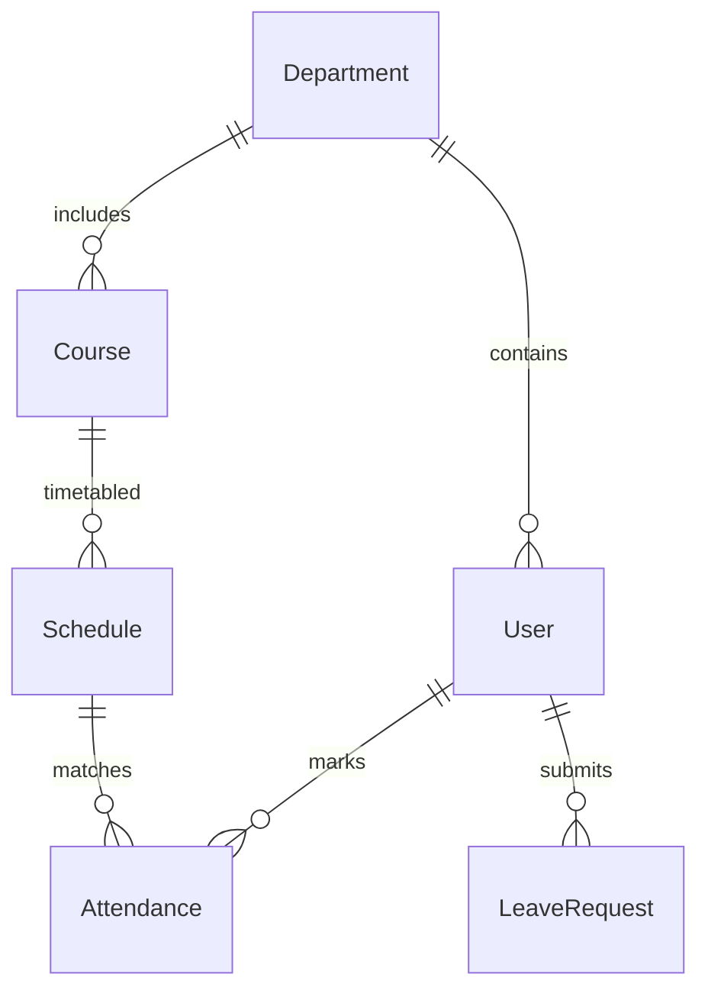

# 🎓 Smart Campus Attendance & Analytics System (SCAAS)

[](https://nextjs.org/)
[](https://expressjs.com/)
[](https://prisma.io/)
[](https://www.postgresql.org/)
[](https://tailwindcss.com/)
[](https://www.docker.com/)

An enterprise-grade, real-time, role-based platform designed to eliminate manual administrative burdens, prevent attendance fraud, and provide students and faculty with actionable, data-driven academic insights through beautiful, responsive dashboards.

---

## 📌 Table of Contents
1. [🌟 Executive Summary & Vision](#-executive-summary--vision)
2. [👥 User Roles & Access Control (RBAC)](#-user-roles--access-control-rbac)
3. [⚙️ Core Modules & System Features](#️-core-modules--system-features)
4. [🛠️ Tech Stack & Rationale](#️-tech-stack--rationale)
5. [📈 Real-World Use Cases](#-real-world-use-cases)
6. [🚀 Quick Start & Installation](#-quick-start--installation)
7. [🐳 Docker Deployment](#-docker-deployment)
8. [📊 Database & Data Model](#-database--data-model)
9. [🤝 Contributing](#-contributing)
10. [📄 License](#-license)

---

## 🌟 Executive Summary & Vision

The **Smart Campus Attendance & Analytics System (SCAAS)** is a full-stack, real-time web platform engineered to modernize campus administration. 

Historically, tracking attendance has been a manual, slow, and error-prone process susceptible to proxy signatures. SCAAS solves this through **automated validation check-ins (geofencing, secure session tokens)**, **interactive dashboard tracking**, and a **Predictive Analytics Suite** that helps students keep track of their attendance targets before it's too late.

### Core Value Propositions:
* **For Faculty:** Mark attendance in seconds using dynamic QR codes, geofenced automated sign-ins, or an optimized grid layout.
* **For Students:** Check real-time stats, monitor progress trends across subjects, receive predictive alerts before falling below minimum thresholds, and apply for digital leave exemptions.
* **For Placement Officers:** View placement-eligible student lists directly filterable by attendance, grade, or department metrics.
* **For Administrators:** Campus-wide compliance overviews, automated audits, department-level comparison metrics, and secure system configuration.

---

## 👥 User Roles & Access Control (RBAC)

The system enforces robust **Role-Based Access Control (RBAC)** across five unique user personas. Each persona gets access to a tailor-made, responsive glassmorphic dashboard:

| Role | Responsibility | Key Features |
| :--- | :--- | :--- |
| **System Administrator** | Manages system-wide settings, user enrollment, departments, courses, and schedules. | Global analytics, user/course management portals, real-time system logs, and data exports. |
| **Teacher / Instructor** | Configures class schedules, initiates sign-in sessions, approves leaves, and marks manual attendance. | Interactive grid toggles, Geofenced / Dynamic QR session controller, student compliance reports, leave approval desk. |
| **Student** | Checks personal attendance records, views warnings, checks in to live sessions, and submits leaves. | Personal dashboard, live QR scan portal, geofenced check-in button, predictive margin alerts, leave submission wizard. |
| **Placement Officer** | Evaluates student academic and attendance standing for recruitment eligibility. | Recruiter eligibility search, bulk export of eligible candidates, student academic-attendance heatmaps. |
| **Event Coordinator** | Generates institutional duty leaves (exemptions) for extracurricular student activities. | Institutional leave generation, attendance credit requests, participant cohort registration. |

---

## ⚙️ Core Modules & System Features

### 🔒 1. Secure Authentication & Session Guards
* **JWT Token Security:** Role-based route guards and cookies secure every API request and page view.
* **Granular RBAC:** Automatically routes users to their specific dashboard layouts upon logging in.

### 📍 2. Multi-Modal Attendance Engine
* **Interactive Grid View:** A highly optimized grid layout for instructors to manually toggle, bulk-mark, or review student records instantly.
* **Geofenced Check-in:** Instructors open a check-in window specifying the class coordinates. The system validates the student's browser-level Geolocation API coordinates against the classroom before recording attendance.
* **Dynamic QR Scanning:** Generates real-time, auto-regenerating QR codes to prevent code-sharing fraud among off-campus students.

### 📊 3. Predictive Deficit Analytics
* **Target Compliance Calculation:** A built-in calculator showing students precisely how many consecutive lectures they can afford to miss, or *must* attend, to remain above their target percentage threshold (e.g., 75%).
* **Risk Categorization:** Color-coded charts showing red alerts for critical deficits, yellow alerts for borderline, and green for compliant.

### 📁 4. Leave & Activity Exemption Portal
* **Digital Workflows:** Students can submit medical certificates or duty leave requests with attachments directly on their dashboard.
* **Automated Exemption Recalculations:** Once approved, the system dynamically recalculates Adjusted Attendance percentages to ensure student compliance matches institutional policy.

---

## 🛠️ Tech Stack & Rationale

SCAAS is built with a modern, high-performance, and unified JavaScript/TypeScript stack:

### 💻 Frontend (Client Tier)
* **Framework:** **Next.js 15 (React 19)** - Utilizing React's Server Component capabilities for blazingly fast load times and optimized client layouts.
* **Styling:** **Tailwind CSS** - Implementing an ultra-premium, dark-mode-first glassmorphic user interface using backdrop blurs, rich neon gradients, and dynamic interactive hover states.
* **Animations:** **Framer Motion** - Providing seamless, premium page transitions and interactive micro-animations that feel responsive and alive.
* **Charts & Analytics:** **Recharts** - Dynamic, responsive SVG charts that render interactive student performance records smoothly.

### ⚙️ Backend (Application Tier)
* **Runtime:** **Node.js** with **TypeScript** and **Express.js** - Secure, structured, and modular controller-service-router patterns.
* **Database Client:** **Prisma ORM** - Full type safety, instant autocomplete queries, and auto-generated database migrations.

### 🗄️ Database & Hosting (Storage Tier)
* **Database:** **PostgreSQL** - Multi-table relational integrity, reliable ACID transactions, and robust indexing for rapid attendance queries.
* **Containerization:** **Docker & Docker Compose** - Ready-to-go environment packaging for local development, testing, and cloud deployments.

---

## 📈 Real-World Use Cases

1. **Preventing Proxy Attendance (Anti-Proxy Safeguard):** By opening a Geofenced or Dynamic rotating QR session, students cannot sign in for their absent classmates. They must be physically present inside the designated classroom coordinates.
2. **Duty Leave / Event Participation Credits:** Student representatives/Event coordinators can upload activity rosters. The system automatically credits attendance exemptions to the selected cohort of students for the duration of the event.
3. **Pre-emptive Academic Counseling:** Using the Predictive Deficit Calculator, faculty advisors can instantly run reports to identify students who are statistically unable to meet their 75% target by the semester's end, allowing for early intervention.
4. **Placement Drive Compliance Audit:** When major campus recruitments happen, placement officers can search for and extract lists of eligible students matching exact attendance, department, or grade filters within a single click.

---

## 🚀 Quick Start & Installation

### Prerequisites
* [Node.js (v18 or higher)](https://nodejs.org/)
* [PostgreSQL](https://www.postgresql.org/) (or use the provided Docker container)
* [Docker Desktop](https://www.docker.com/products/docker-desktop/) *(optional)*

### Repository Setup
```bash
# Clone the repository
git clone https://github.com/Sohan212121/Smart-Campus-Ssytem.git
cd Smart-Campus-Ssytem
```

### 1. Backend Setup
1. Navigate to the backend directory:
   ```bash
   cd backend
   ```
2. Install dependencies:
   ```bash
   npm install
   ```
3. Configure your environment variables. Create a `.env` file based on `.env.example`:
   ```bash
   cp .env.example .env
   # Open .env and adjust the DATABASE_URL and JWT_SECRET
   ```
4. Run Database Migrations to initialize your PostgreSQL schema:
   ```bash
   npx prisma migrate dev --name init
   ```
5. Run the seed script to populate default departments, courses, users, and roles:
   ```bash
   npm run seed
   ```
6. Start the Express development server:
   ```bash
   npm run dev
   ```

### 2. Frontend Setup
1. Open a new terminal and navigate to the frontend directory:
   ```bash
   cd frontend
   ```
2. Install dependencies:
   ```bash
   npm install
   ```
3. Start the Next.js development server:
   ```bash
   npm run dev
   ```
4. Open [http://localhost:3000](http://localhost:3000) in your browser.

---

## 🐳 Docker Deployment

The entire system is completely dockerized for fast one-command setup. Make sure Docker is running on your machine.

### Run everything (Frontend + Backend + PostgreSQL)
From the root directory, run:
```bash
docker-compose up --build
```
This command spins up:
- **PostgreSQL Database** running on port `5432`
- **Express Backend API** running on `http://localhost:5000`
- **Next.js Web App** running on `http://localhost:3000`

To stop the containers:
```bash
docker-compose down
```

---

## 📊 Database & Data Model

The application leverages PostgreSQL's relational capabilities, managed through a clean Prisma schema:



* **User**: Stores demographic info, credentials, and user role (`ADMIN`, `TEACHER`, `STUDENT`, `PLACEMENT_OFFICER`, `EVENT_COORDINATOR`).
* **Department**: Groups courses and profiles.
* **Course**: Defines academic subjects (credits, department association).
* **Schedule**: Class timings, room coordinates, and geofencing configuration.
* **Attendance**: Real-time sign-in status (`PRESENT`, `ABSENT`, `EXCUSED`, `LATE`) and check-in geolocation data.
* **LeaveRequest**: Digital workflows for leaves, status tracking, and attachment links.

---

## 🤝 Contributing

Contributions make the open-source community an amazing place to learn, inspire, and create. Any contributions you make are **greatly appreciated**.

1. Fork the Project
2. Create your Feature Branch (`git checkout -b feature/AmazingFeature`)
3. Commit your Changes (`git commit -m 'Add some AmazingFeature'`)
4. Push to the Branch (`git push origin feature/AmazingFeature`)
5. Open a Pull Request

---

## 📄 License

Distributed under the MIT License. See `LICENSE` for more information.

---

**Developed with ❤️ for Smart Campuses everywhere.**
